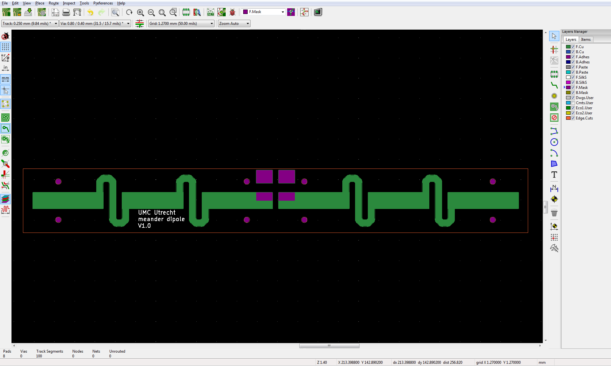
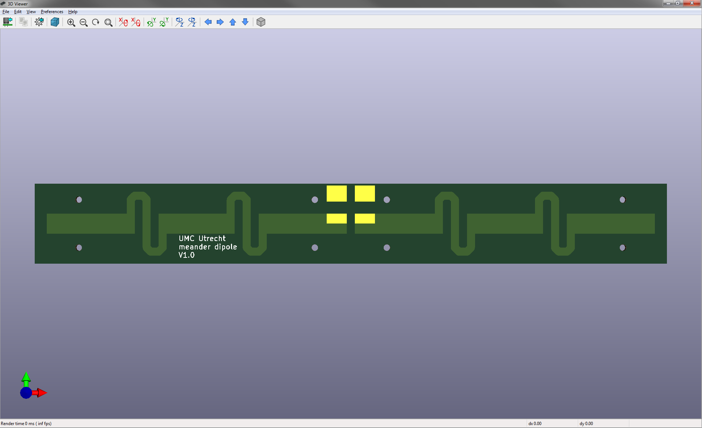

# Fractionated dipole antenna (2015)

## About us
This design has been made by the coil-lab and Alexander Raaijmakers of the High Field MRI Group of the UMC Utrecht in the Netherlands. We are part of a research group which means we feel the need to publicise some of our designs to whomever can make use of it, to further the research of MRI applications.

## The design
As publicised by Raaijmakers et al. The fractionated dipole antenna: A new antenna for body imaging at 7 Tesla. Magnetic Resonance in Medicine; 2015. This dipole is the same as the one used as in the mentioned paper. 

The PCB has been drawn in Kicad 5.1.4.

## Download
Gerber production files for the latest version of the PCB can be found in the 'Gerber' folder. Press the 'Clone or download' button at the top of this page to download the files. You can also make your own production files by downloading the Kicad project and generating them.

## Images
**PCB Schematic**
<!---  --->

**3D Image**
<!---  --->

**3D Image zoom**
<!---  --->

